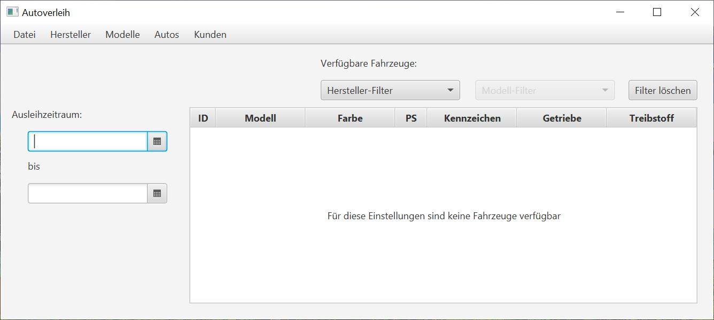
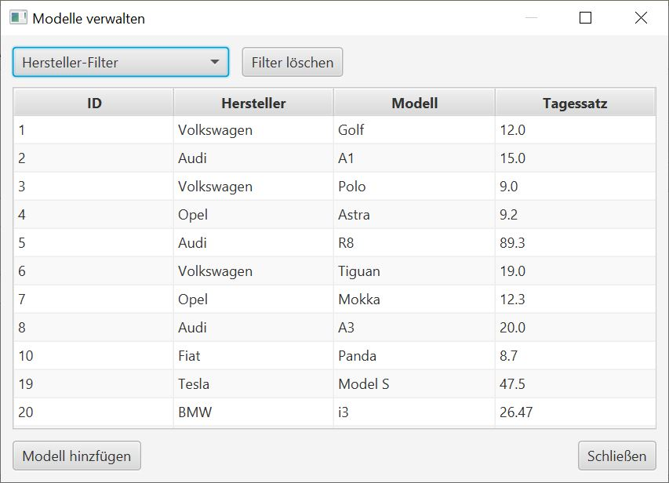
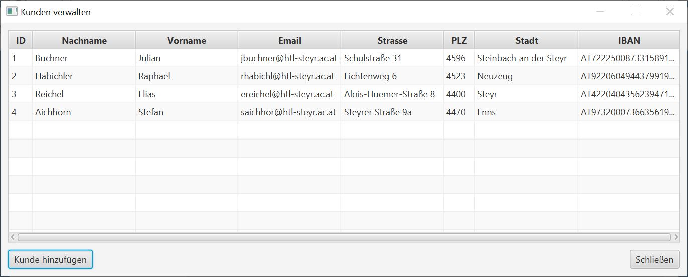
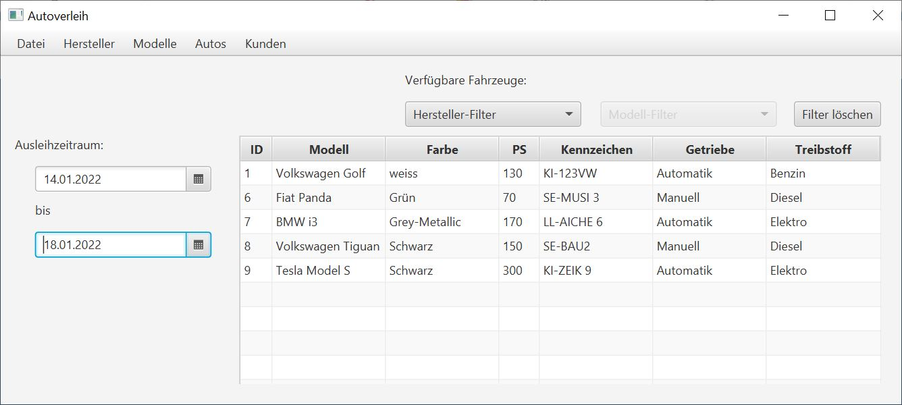
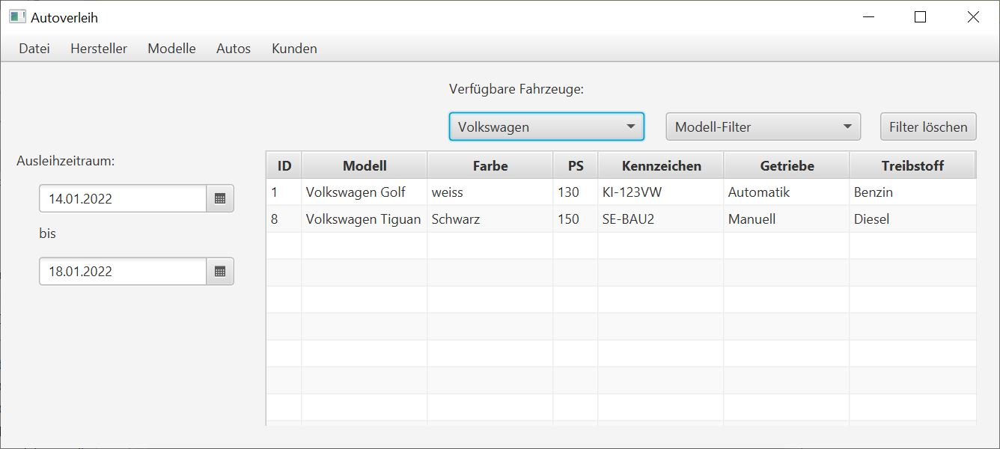
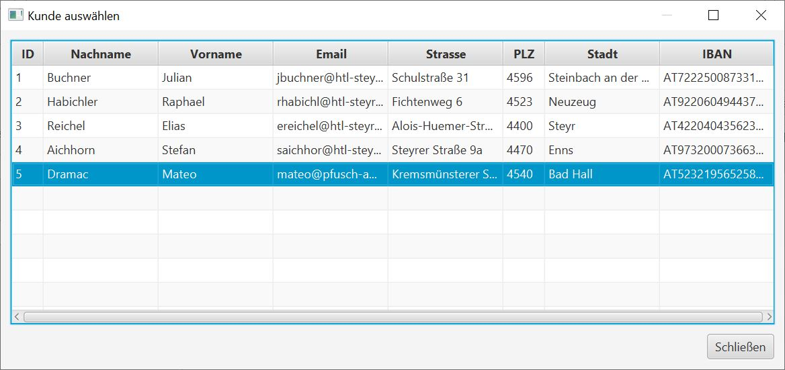
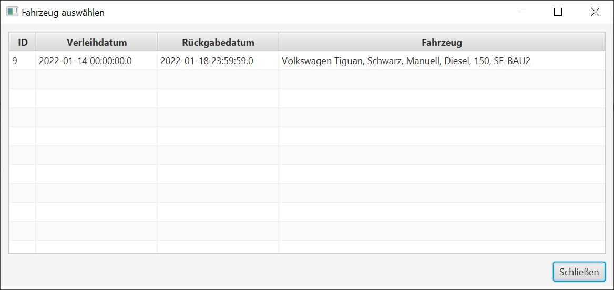
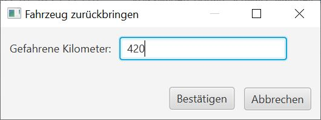
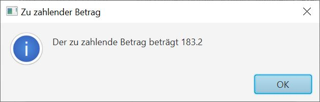

# Autoverleih

## Aufbau der Datenbank

### Tabellen
| Tabelle              | Funktion                                                    |
|----------------------|-------------------------------------------------------------|
| mjaeger_manufacturer | Automarke (z.B. VW, Seat, Tesla)                            |
| mjaeger_model        | Modell (z.B. Golf, A1, 3er, Model X)                        |
| mjaeger_car          | Fahrzeug (z.B. VW Golf, 130 PS, Automatik, Benzin           |
| mjaeger_customer     | Kunde                                                       |
| mjaeger_rental       | Verleihung                                                  |
| mjaeger_fuel         | Treibstoff (z.B. Benzin, Diesel), nicht per GUI bearbeitbar |
| mjaeger_transmission | Getriebe (Automatik, Manuell), nicht per GUI bearbeitbar    |

## Verbindung Manufacturer, Model und Car
Es gibt den Manufacturer (Hersteller/Automarke). Zu diesem gehören mehrere
Modelle (z.B. VW Golf, Seat Alhambra).   
Car bezeichnet dabei ein spezielles Fahrzeug mit Getriebe, Treibstoff und einem Kennzeichen.

Ich habe mich für dieses System entschieden, da es überaus flexibel ist.
Es können einfach mehrere Fahrzeuge des gleichen Modells eingesetzt werden.
Eine Filterung nach Modell ist so auch möglich.

## Oberfläche
Da der Autoverleih die Hauptfunktion dieser Anwendung ist,
ist die Oberfläche so aufgebaut, 
dass das Verleihen eines Fahrzeugs auf der Startseite stattfindet.
Durch eine Menüleiste können die unterschiedlichen Datensätze 
(Manufacturer, Mode, Car, Customer) bearbeitet werden.

Alle TableViews sind so konzipiert, dass die Datensätze durch einen Doppelklick bearbeitet werden können.   
Für das Hinzufügen eines neuen Datensatzes gibt es immer einen eigenen Button.
Die Spalten werden auf die gesamte Breite der TableView aufgeteilt.

### Mieten eines Autos

1) Gültigen Zeitraum auswählen (Enddatum vor dem Startdatum ist nicht gültig)   

2) Fahrzeug auswählen (Filtern nach Hersteller und Modell) mit Doppelklick   

3) Kunde wählen (neues Fenster)   

### Zurückgeben eines Autos

Das Zurückgeben eines Autos befindet sich unter dem Menüpunkt Customer.

1) Kunde wählen   

2) Offene Miete wählen   

3) Gefahrene Kilometer eingeben   

Schlussendlich wird der zu zahlende Betrag ausgegeben und die Miete auf erledigt gesetzt.
Daraufhin erscheint wieder die Auswahl der Kunden.
